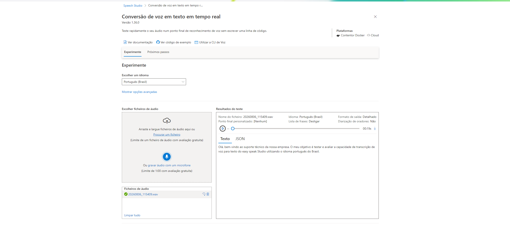
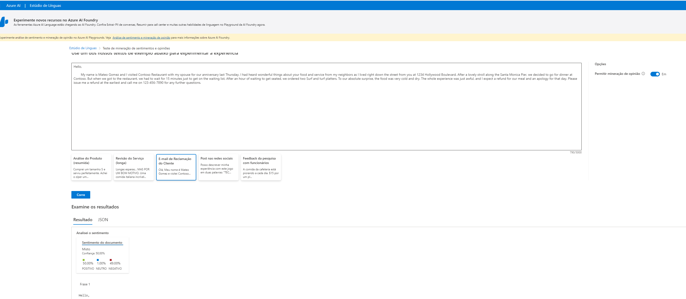

# Explorando o Azure Speech Studio e Language Studio

> 📌 **Aviso:** Repositório criado exclusivamente para fins educacionais e de demonstração prática durante o desafio de código da plataforma [DIO](https://www.dio.me/).

Este repositório documenta a prática realizada com as ferramentas de IA da Microsoft no ecossistema Azure: **Speech Studio** e **Language Studio**.

---

## 🎙️ 1. Azure Speech Studio
No Azure Speech Studio, foi efetuado um teste prático de transcrição de áudio em tempo real com uma mensagem de saudação de suporte técnico em português.

### Detalhes do Teste:
- **Serviço:** Conversão de voz em texto em tempo real (Speech-to-Text)
- **Idioma Selecionado:** Português (Brasil)
- **Ficheiro de Áudio:** `20260806_115409.wav` (duração: 19s)
- **Resultado da Transcrição:** *"Olá, bem-vindo ao suporte técnico da nossa empresa. O meu objetivo é testar e avaliar a capacidade de transcrição de voz para texto do easy speak Studio utilizando o idioma português do Brasil."*

### Captura de Ecrã:

### Insights Técnicos:
- **Precisão na Linguagem Natural:** A ferramenta identificou corretamente pausas e pontuações na frase.
- **Transcrição Fonética:** O termo *"Azure Speech"* pronunciado durante a gravação foi interpretado foneticamente como *"easy speak"*, exemplificando um caso de uso real onde modelos customizados (*Custom Speech*) podem ser aplicados para melhorar o reconhecimento de marcas e termos técnicos.

---

## 🧠 2. Azure Language Studio
No Azure Language Studio, explorou-se a funcionalidade de **Análise de Sentimentos e Mineração de Opiniões** em textos não estruturados.

### Detalhes do Teste:
- **Serviço:** Análise de Sentimento (Sentiment Analysis)
- **Exemplo Utilizado:** E-mail de Reclamação do Cliente
- **Resultado Obtido:**
  - **Sentimento Geral:** Misto
  - **Distribuição de Confiança:** 50% Positivo | 1% Neutro | 49% Negativo

### Captura de Ecrã:

### Insights Técnicos:
- **Análise Multidimensional:** A ferramenta consegue detetar sentimentos opostos num mesmo texto (elogios à comida combinados com insatisfação no atendimento/tempo de espera).
- **Aplicações Práticas:** Permite triagem automática de reclamações prioritárias em canais de atendimento e monitorização de experiência do utilizador.
- 
